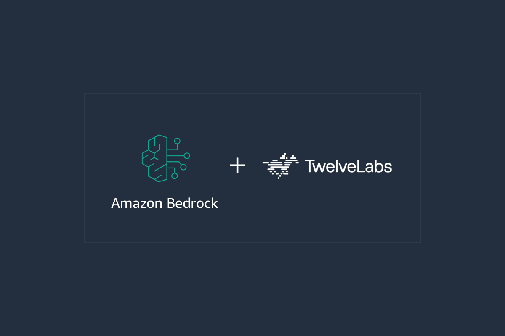

# TwelveLabs on Amazon Bedrock Workshop

<p align="center">
  
</p>


These hands-on workshops introduce how to use TwelveLabs models on Amazon Bedrock. The workshops are designed to help you understand how to leverage TwelveLabs' video understanding capabilities within the Bedrock ecosystem, with step-by-step guides and example notebooks.

Check the [documentation](https://docs.aws.amazon.com/bedrock/latest/userguide/models-regions.html) for the latest list of supported regions for each model.

### Workshop Catalog
| Workshop Name               | Notebook File Name                                               |
|-----------------------------|------------------------------------------------------------------|
| Marengo on Bedrock Workshop | [tl-marengo-bedrock-workshop.ipynb](tl-marengo-bedrock-workshop.ipynb) |
| Pegasus on Bedrock Workshop | [tl-pegasus-bedrock-workshop.ipynb](tl-pegasus-bedrock-workshop.ipynb) |

## Getting Started

### Option 1: AWS Workshop Studio (coming soon...)

### Option 2: CloudFormation Template (coming soon...)
**Step 1: Deploy CloudFormation Template**

**Step 2: Access SageMaker Studio**

**Step 3: Run Notebook in JupyterLab**

### Option 3: Manual Setup

**Prerequisites**
1. [Create S3 Bucket](https://docs.aws.amazon.com/AmazonS3/latest/userguide/create-bucket-overview.html)
2. [Create an OpenSearch Serverless Collection](https://docs.aws.amazon.com/opensearch-service/latest/developerguide/serverless-manage.html)
3. [Open a Juypter environment](https://jupyter.org/install)
4. [Configure AWS credentials for boto3](https://boto3.amazonaws.com/v1/documentation/api/latest/guide/credentials.html)
5. [Enable access to TwelveLabs models on Bedrock](https://docs.aws.amazon.com/bedrock/latest/userguide/model-access-modify.html)

**Step 1: Clone this repo**

```
git clone https://github.com/twelvelabs-io/tl-solutions-samples.git
```

**Step 2: Open and walk through notebook**

Open [tl-marengo-bedrock-workshop.ipynb](tl-marengo-bedrock-workshop.ipynb) for the Marengo on Bedrock workshop or [tl-pegasus-bedrock-workshop.ipynb](tl-pegasus-bedrock-workshop.ipynb) for the Pegasus on Bedrock workshop.

Follow the instructions in the notebooks to update the required variables.

## Resources
- [AWS Docs: TwelveLabs on Amazon Bedrock](https://docs.aws.amazon.com/bedrock/latest/userguide/model-parameters-twelvelabs.html)
- [AWS Blog: TwelveLabs video understanding models are now available in Amazon Bedrock](https://aws.amazon.com/blogs/aws/twelvelabs-video-understanding-models-are-now-available-in-amazon-bedrock/)